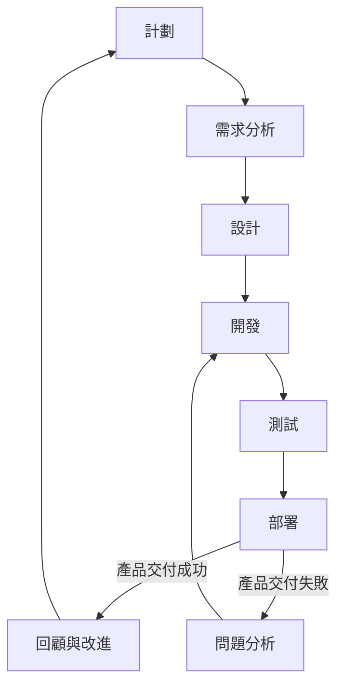
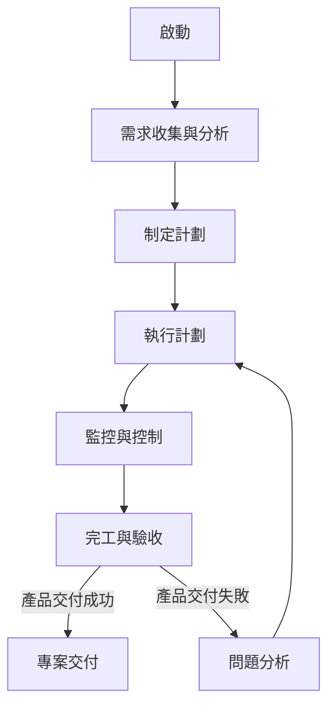

# 專案管理流程圖

Agile

```mermaid
graph TD;
    A[計劃] --> B[需求分析];
    B --> C[設計];
    C --> D[開發];
    D --> E[測試];
    E --> F[部署];
    F -- 產品交付成功 --> G[回顧與改進];
    G --> A;
    F -- 產品交付失敗 --> H[問題分析];
    H --> D;
```

Waterfall

```mermaid
graph TD;
    A[啟動] --> B[需求收集與分析];
    B --> C[制定計劃];
    C --> D[執行計劃];
    D --> E[監控與控制];
    E --> F[完工與驗收];
    F -- 產品交付成功 --> G[專案交付];
    F -- 產品交付失敗 --> H[問題分析];
    H --> D;
```

